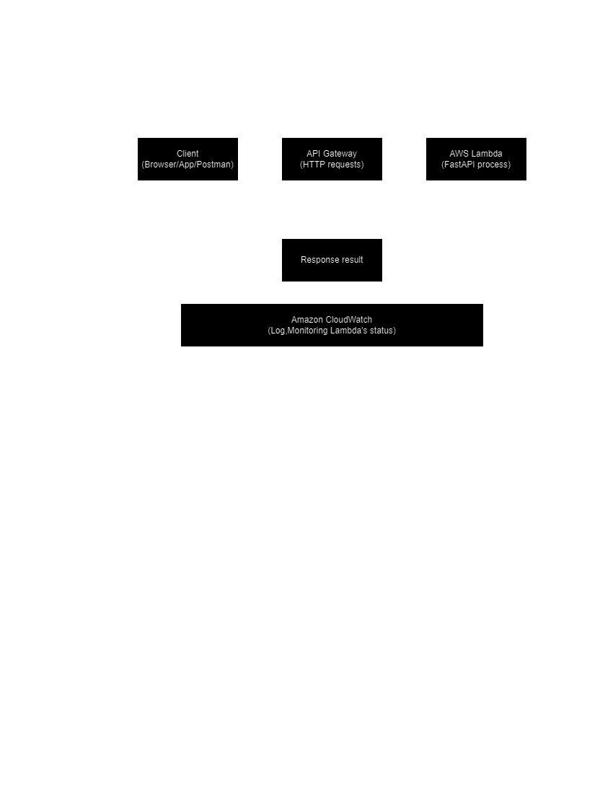

# Cross-Origin FastAPI Deployment Using CI/CD with Serverless Framework

This repository demonstrates how to implement a cross-origin API (CORS-enabled) using AWS Lambda and API Gateway with the Serverless Framework, leveraging a CI/CD pipeline to automate deployment. The setup includes GitHub Actions for continuous integration (CI) and continuous deployment (CD), ensuring that API updates are automatically deployed to AWS Lambda when code changes are merged into the `dev` or `main` branches.

## Prerequisites

Before you can deploy the API using this CI/CD pipeline, ensure the following prerequisites are met:

### 1. AWS Account Setup
- **AWS Access Key and Secret Access Key**:
  - You will need an AWS account with appropriate permissions to create and manage Lambda functions, API Gateway resources, CloudWatch alarms, and other related resources.
  - Create a new IAM user or use an existing one with the `AdministratorAccess` policy (or equivalent permissions) for deployment.
  - Store the following secrets in GitHub:
    - `AWS_ACCESS_KEY_ID`: Your AWS Access Key ID.
    - `AWS_SECRET_ACCESS_KEY`: Your AWS Secret Access Key.
  
  In your GitHub repository, navigate to **Settings > Secrets and Variables > Actions > New repository secret** and add the AWS credentials there.

### 2. Serverless Framework Setup
- **Serverless Dashboard**:
  - Create an account on the [Serverless Framework](https://www.serverless.com/) and generate a Serverless Access Key.
  - Store the access key as a secret in GitHub:
    - `SERVERLESS_ACCESS_KEY`: Your Serverless Access Key.
  - This key allows the Serverless Framework to authenticate and manage your services.
  
### 3. Python Environment
- Ensure your project has a valid `requirements.txt` file containing all the Python dependencies for your application (e.g., FastAPI, etc.). The CI pipeline will ensure the file is UTF-8 encoded and properly formatted before deployment.

### 4. Required Serverless Plugins
The following plugins will be used in the Serverless deployment:
- **serverless-python-requirements**: This helps bundle Python dependencies for AWS Lambda functions.
- **serverless-wsgi**: For deploying WSGI-compatible applications like FastAPI to AWS Lambda.
- **serverless-plugin-canary-deployments**: Allows controlled deployment strategies (e.g., canary deployments) for rolling out new Lambda versions gradually.

## Workflow Overview

### Workflow Trigger
The CI/CD pipeline is triggered on `push` events to the `dev` or `main` branches, as well as on pull requests targeting these branches. Depending on the branch, the deployment environment will be either `dev` (for the `dev` branch) or `prod` (for the `main` branch).

### Pipeline Steps

1. **Code Checkout**: The pipeline fetches the latest code from the repository using `actions/checkout`.
   
2. **Python Setup**: The correct version of Python (`3.11`) is set up in the environment using `actions/setup-python`.

3. **Ensure `requirements.txt` Encoding**: This step ensures the `requirements.txt` file is properly encoded in UTF-8 without BOM (Byte Order Mark) and converts line endings to Unix format, preventing deployment issues in different environments.

4. **Install Dependencies**: The required Python packages are installed using `pip`, based on the `requirements.txt` file.

5. **Run Tests**: Unit tests are executed using `pytest` to ensure the code is working as expected before deployment.

6. **Install Serverless and Plugins**: The pipeline installs the Serverless Framework CLI and required plugins for managing Python dependencies, WSGI compatibility, and canary deployments.

7. **Deploy to AWS Lambda**: 
   - Depending on the branch (`main` or `dev`), the pipeline deploys the API to AWS Lambda using the corresponding `prod` or `dev` stage.
   - The API Gateway and Lambda functions are automatically configured to support CORS (Cross-Origin Resource Sharing).

## Data Flow Architecture

